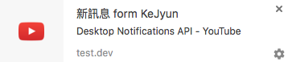

# Desktop Notification

## 建立測試頁面

```html
<html>
    <head>
        <title>Desktop notifications</title>
    </head>
    <body>
        <h1>Hi Notification</h1>
        <a href="#" id="dnperm">Request permission</a>
        <a href="#" id="dntrigger">Trigger</a>
    </body>
</html>
<script src="notification.js"></script>
```

## 建立 notification.js

```javascript
var dnperm = document.getElementById('dnperm');
var dntrigger = document.getElementById('dntrigger');

dnperm.addEventListener('click', function(e) {
    e.preventDefault();
    if (!window.Notification) {
        alert('抱歉，通知系統在您的瀏覽器不支援');
    } else {
        Notification.requestPermission(function(p){
            if (p === 'denied') {
                alert('您封鎖了通知');
            } else if(p === 'granted') {
                alert('您授權了通知');
            }
        });
    }
});

dntrigger.addEventListener('click', function(e) {
    var notify;
    e.preventDefault();

    if(Notification.permission === 'default') {
        alert('在執行前，請允許通知系統權限');
    } else {
        notify = new Notification('新訊息 form KeJyun', {
            body: 'Desktop Notifications API - YouTube',
            icon: 'https://s.ytimg.com/yts/img/favicon_32-vfl8NGn4k.png',
            tag: '1234'
        });

        notify.onclick = function() {
            window.location = 'https://www.youtube.com/watch?v=IdK0nZdrkOk';
        }
    }
});
```

## Demo



## 參考資料
* [Desktop Notifications API - YouTube](https://www.youtube.com/watch?v=IdK0nZdrkOk)