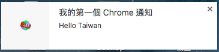
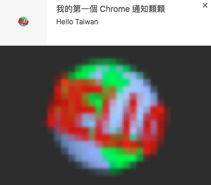
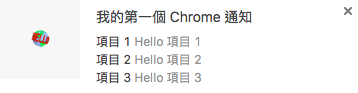
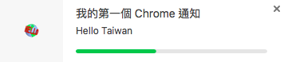

# Rich Notifications

## 一般通知（basic）
### 設定 `manifest.json`

```json
{
    "manifest_version": 2,

    "name": "Rich Notification",
    "description": "Rich Notification description",
    "version": "1.0",
    "background": {
        "scripts": ["background.js"]
    },
    "browser_action": {
        "default_popup": "index.html"
    },
    "permissions": [
        "notifications"
    ],
    "icons": {
        "16": "icon.png",
        "32": "icon.png",
        "64": "icon.png",
        "128": "icon.png"
    }
}
```

### 新增 default_popup index.html 頁面

> 若通知資訊中有其他特殊字串編碼，如中文字，則必須要在頁面中設定該頁的編碼，像是`<meta charset="utf-8">`

```html
<html>
    <head>
        <title>My First Chrome Extension</title>
        <meta charset="utf-8">
        <script src="app.js"></script>
    </head>
    <body>
        <h1>Hello Taiwan!</h1>
        <h1>Hello Taiwan!</h1>
        <h1>Hello Taiwan!</h1>
    </body>
</html>
```

### 編輯 `app.js`

```javascript
var options = {
    type:"basic",
    title: "我的第一個 Chrome 通知",
    message: "Hello Taiwan",
    iconUrl: "icon.png"
};

chrome.notifications.create(options, callback);

function callback() {
    console.log('popup done');
}
```

### 測試通知

在點選套件按鈕後，就可以看到我們剛剛設定的通知訊息



## 圖片通知 (image)

### 編輯 `app.js`

```javascript
var options = {
    type:"image",
    title: "我的第一個 Chrome 通知顆顆",
    message: "Hello Taiwan",
    iconUrl: "icon.png",
    imageUrl: "icon.png"
};

chrome.notifications.create(options, callback);

function callback() {
    console.log('popup done');
}
```

### 測試通知

在點選套件按鈕後，就可以看到我們剛剛設定的圖片通知訊息



## 清單通知 (list)

### 編輯 `app.js`

```javascript
var options = {
    type:"list",
    title: "我的第一個 Chrome 通知",
    message: "Hello Taiwan",
    iconUrl: "icon.png",
    items: [
        { title: "項目 1", message: "Hello 項目 1"},
        { title: "項目 2", message: "Hello 項目 2"},
        { title: "項目 3", message: "Hello 項目 3"}
    ]
};

chrome.notifications.create(options, callback);

function callback() {
    console.log('popup done');
}
```

### 測試通知

在點選套件按鈕後，就可以看到我們剛剛設定的清單通知訊息



## 進度通知 (progress)

### 編輯 `app.js`

```javascript
var options = {
    type:"progress",
    title: "我的第一個 Chrome 通知",
    message: "Hello Taiwan",
    iconUrl: "icon.png",
    progress: 42
};

chrome.notifications.create(options, callback);

function callback() {
    console.log('popup done');
}
```

### 測試通知

在點選套件按鈕後，就可以看到我們剛剛設定的進度通知訊息



## 通知開啟視窗

### 編輯 `app.js`

```javascript
var options = {
    type:"basic",
    title: "我的第一個 Chrome 通知",
    message: "Hello Taiwan",
    iconUrl: "icon.png"
};

chrome.notifications.create(options, callback);

chrome.notifications.onClicked.addListener(openNewTabHandler);

function callback() {
    console.log('popup done');
}

function openNewTabHandler() {
    chrome.tabs.create({
        url:"https://www.google.com.tw/"
    });
}
```

在加入 `chrome.notifications.onClicked.addListener(openNewTabHandler);` 傾聽點選事件後，我們在點選通知會直接開啟一個新頁面導向到指定的網址


## 參考資料
* [https://developer.chrome.com/apps/richNotifications](https://developer.chrome.com/apps/richNotifications)
* [chrome.notifications - Google Chrome](https://developer.chrome.com/apps/notifications#event-onClicked)