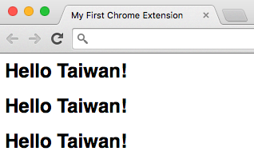
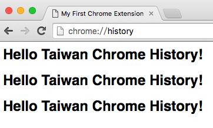

# 複寫 Chrome 頁面 (Overriding Chrome Pages)

Chrome 可以允許我們複寫他們的功能，像是「新頁籤（newtab）」、「歷史記錄（history）」、「書籤管理（bookmark）」，但同時我們只能覆寫一個功能，沒辦法同時重複複寫多個功能

## 複寫新頁籤（newtab）

在 `manifest.json` 加入覆寫的設定如下

```json
{
    "chrome_url_overrides": {
        "newtab":"newtab.html"
    },
}
```

在 `newtab.html` 檔案中我們寫入我們要複寫的 html 資料

```html
<html>
    <head>
        <title>My First Chrome Extension</title>
    </head>
    <body>
        <h1>Hello Taiwan!</h1>
        <h1>Hello Taiwan!</h1>
        <h1>Hello Taiwan!</h1>
    </body>
</html>
```

這樣我們在開啟新頁籤的時候，就可以看到我們複寫的新頁籤了



## 複寫歷史紀錄（history）

```json
{
    "chrome_url_overrides": {
        "history":"history.html"
    },
}
```

在 `history.html` 檔案中我們寫入我們要複寫的 html 資料

```html
<html>
    <head>
        <title>My First Chrome Extension</title>
    </head>
    <body>
        <h1>Hello Taiwan Chrome History!</h1>
        <h1>Hello Taiwan Chrome History!</h1>
        <h1>Hello Taiwan Chrome History!</h1>
    </body>
</html>
```

這樣我們在看「歷史紀錄（chrome://history/）」的時候，就可以看到我們複寫的頁面了



## 參考資料
* [Override Pages - Google Chrome](https://developer.chrome.com/extensions/override)
* [Chrome Extension Tutorial 6: Overriding Chrome Pages - YouTube](https://www.youtube.com/watch?v=bzXg7r-1IaY&list=PLYxzS__5yYQlWil-vQ-y7NR902ovyq1Xi&index=3#t=136.604988)