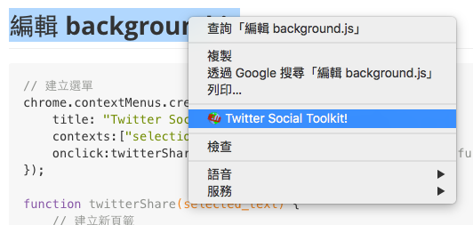
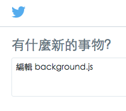

# Twitter 分享小工具

## 設定 `manifest.json`

```json
{
    "manifest_version": 2,

    "name": "Twitter Social Toolkit",
    "description": "Twitter Social Toolkit description",
    "version": "1.0",
    "background": {
        "scripts": ["background.js"]
    },
    "icons": {
        "16": "icon.png",
        "32": "icon.png",
        "64": "icon.png",
        "128": "icon.png"
    },
    "permissions": [
        "contextMenus"
    ]
}
```

## 編輯 background.js

```javascript
// 建立選單
chrome.contextMenus.create({
    title: "Twitter Social Toolkit!",   // 選單名稱
    contexts:["selection"],             // 選單作用狀態
    onclick:twitterShare                // 點選動作 callback function
});

function twitterShare(selected_text) {
    // 建立新頁籤
    chrome.tabs.create({
        url:"https://twitter.com/intent/tweet?text="+selected_text.selectionText
    });
}
```

## 使用 Twitter Social Toolkit

選取文字並點選右鍵，即可看到我們的套件



點選選單套件連結後，我們就會將選取的文字，準備 share 到 Twitter 了！



## 選單事件

|  事件名稱 | 說明  |
|---|---|
| selection  |  選擇文字 |
| link  |  連結 |
| image  |  圖片 |
| page  |  頁面 |

選單事件 `background.js` share 範例

```javascript
// 所有選單事件
var contextsList = ["selection", "link", "image", "page"];

// 設定所有選單事件
for (var i = 0; i < contextsList.length; i++) {
    var context = contextsList[i];
    var title = "Twitter Social Toolkit! share this 「" +context+ "」 on your profile";
    chrome.contextMenus.create({
        title: title,           // 選單名稱
        contexts:[context],     // 選單作用狀態
        onclick:twitterShare,   // 點選動作 callback function
        id:context              // 指定選單編號
    });
}

// Twitter 分享功能
function twitterShare(selector, tab) {
    // 分享文字
    var sharetext = '';

    // 根據選單編號（選單事件）做不同文字處理
    switch(selector.menuItemId){
        case 'selection':
            sharetext = selector.selectionText;
            break;
        case 'link':
            sharetext = selector.linkUrl;
            break;
        case 'image':
            sharetext = selector.srcUrl;
            break;
        case 'page':
            sharetext = tab.title + "  " + selector.pageUrl;
            break;
    }

    // 開新視窗
    chrome.windows.create({
        url:"https://twitter.com/intent/tweet?text="+encodeURIComponent(sharetext),
        type:"panel"
    });
}
```


## 參考資料
* [Chrome Extension Tutorial 8: Twitter Social Toolkit - Part 1 - YouTube](https://www.youtube.com/watch?v=tVENJJzZScQ&index=8&list=PLYxzS__5yYQlWil-vQ-y7NR902ovyq1Xi)
* [Chrome Extension Tutorial 8: Twitter Social Toolkit - Part 2 - YouTube](https://www.youtube.com/watch?v=wLRkzRrL6fQ&list=PLYxzS__5yYQlWil-vQ-y7NR902ovyq1Xi&index=9)
* [Chrome Extension Tutorial 8: Twitter Social Toolkit - Part 3 - YouTube](https://www.youtube.com/watch?v=Johz4yWM-0E&index=10&list=PLYxzS__5yYQlWil-vQ-y7NR902ovyq1Xi)
* [Chrome Extension Tutorial 8: Twitter Social Toolkit - Part 4 - YouTube](https://www.youtube.com/watch?v=m1uJ1kSdkq0&list=PLYxzS__5yYQlWil-vQ-y7NR902ovyq1Xi&index=11)
* [Chrome Extension Tutorial 8: Twitter Social Toolkit - Part 5 - YouTube](https://www.youtube.com/watch?v=d-np1Q1ak9c&list=PLYxzS__5yYQlWil-vQ-y7NR902ovyq1Xi&index=12)