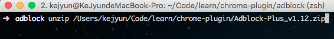

# 下載套件

## 下載

我們可以到[Chrome Extension Downloader](http://chrome-extension-downloader.com/)網站，直接貼上套件網址，將套件下載下來

## 變更副檔名 crx 為 zip

下載下來的套件我們將 crx 的副檔名變更為 zip，就可以解壓縮這個套件的原始碼

## 解壓縮套件原始碼

> 在 mac 我們直接點選 zip 檔案做解壓縮，壓縮檔案會在 `zip` 與 `cpgz` 副檔名相互來回的無窮迴圈的互解壓縮，所以必須要使用 `unzip` 指令去做解壓縮動作

## 套件原始碼

解壓縮完成後就可以看到該套件的原始碼了！

## 參考資料
* [Chrome Extension Downloader](http://chrome-extension-downloader.com/)
* [Chrome Extension Tutorial 14: Download .crx Chrome Extension - YouTube](https://www.youtube.com/watch?v=Xf41EpfM5SA&list=PLYxzS__5yYQlWil-vQ-y7NR902ovyq1Xi&index=13#t=106.847733)