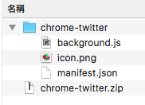
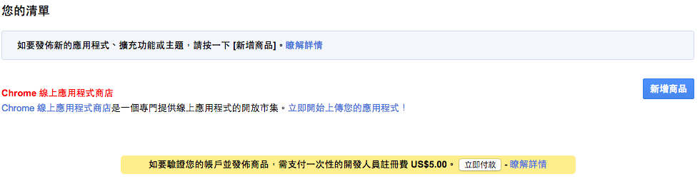
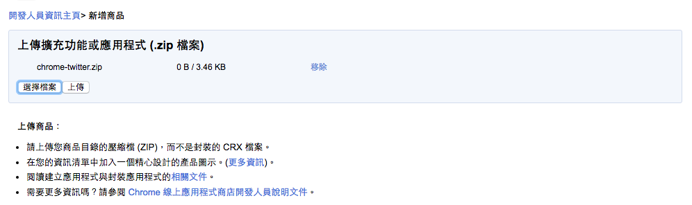
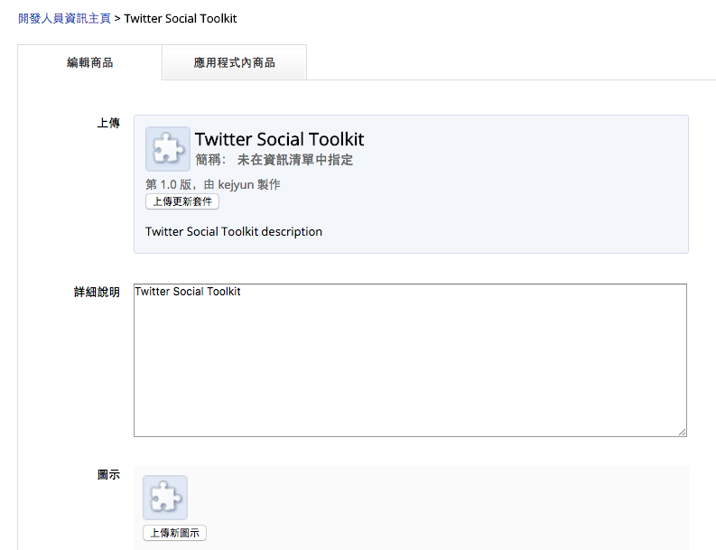
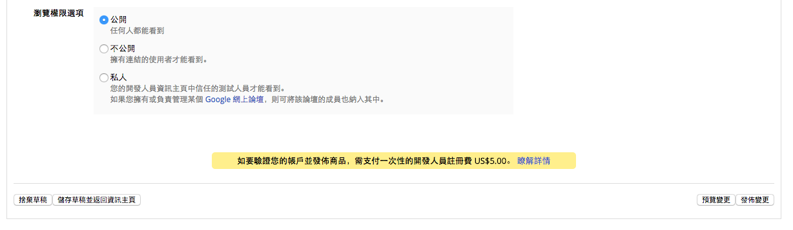
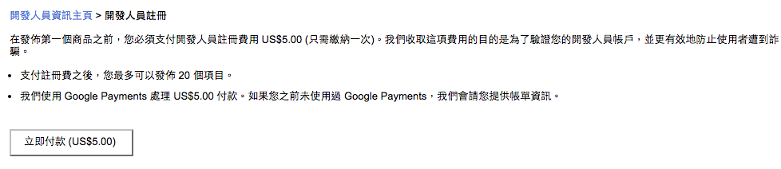
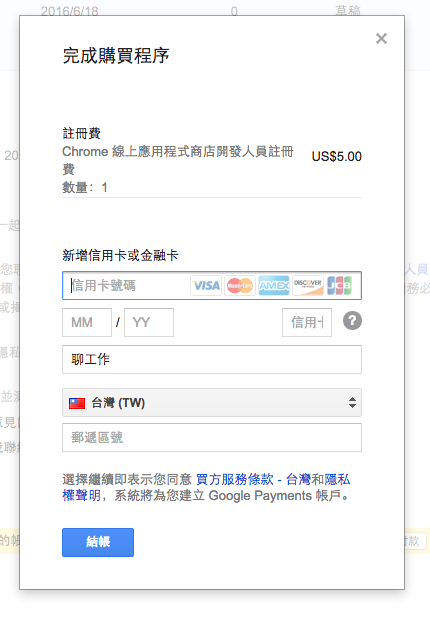
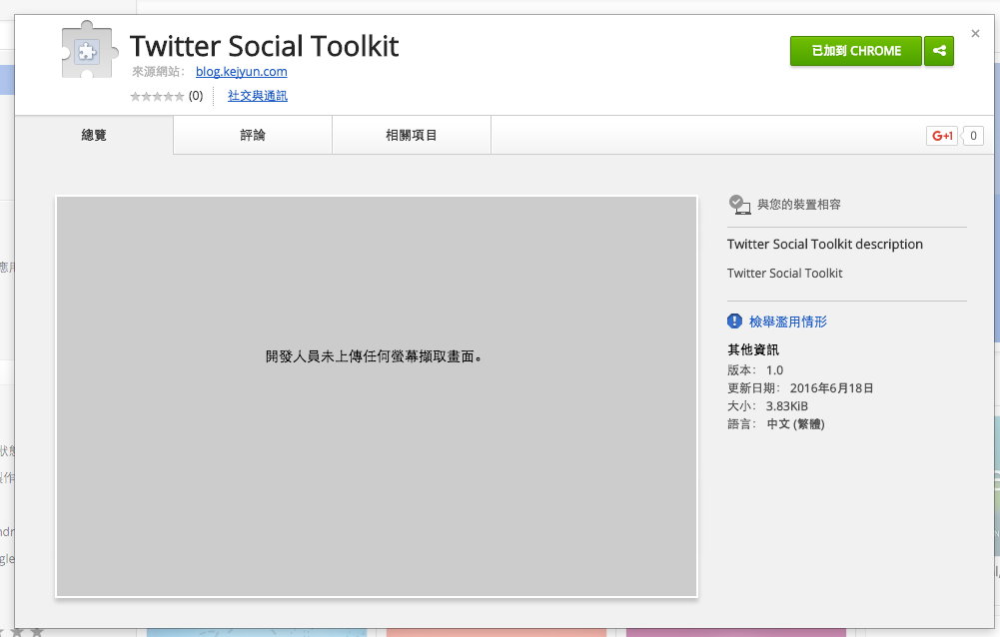

# 發布套件

## 壓縮 Chrome 套件目錄

Chrome 套件發布是透過 zip 壓縮檔上傳發布的，要發布前，需將你的套件壓縮成 zip

## 新增商品

到[Chrome 開發人員資訊主頁(Chrome Developer Dashboard)](https://chrome.google.com/webstore/developer/dashboard?hl=zh-TW)中，我們可以新增商品

> 若要發布套件，則需要花費 $5 美元去註冊開發人員帳號才能夠發布套件喔

## 上傳套件

點選新增商品，同意服務條款後，我們會看到需要上傳擴充套件 zip 檔案的頁面，可以把我們壓縮的套件檔案進行上傳

## 設定套件資訊

在我們上傳完套件後，需要將一些套件的資訊設定好，像是"圖示"、"詳細說明"、"擷取畫面"、"類型"、"語言"...等等的資訊，讓其他看到此套件使用者可以很快的暸解你的套件

## 發佈套件

在設定完成後，我們可以按發布變更，開始將我麼的套件發佈出去

## 付款成為 Chrome Plugin Developer

在要發佈套件前，會需要支付 $5 美元的開發者人員帳號費用

## 發布套件完成

發布後稍待一下，你就可以看到你的套件已經可以在 Chrome 應用程式商店找到摟～

在你的[Chrome 開發人員資訊主頁(Chrome Developer Dashboard)](https://chrome.google.com/webstore/developer/dashboard?hl=zh-Hant)中，也可以看到現在這個套件的狀況

## 參考資料
* [Chrome 開發人員資訊主頁(Chrome Developer Dashboard)](https://chrome.google.com/webstore/developer/dashboard?hl=zh-Hant)
* [Chrome Extension Tutorial 13: Publishing Chrome Extension! - YouTube](https://www.youtube.com/watch?v=DpdYTAhDWbs&list=PLYxzS__5yYQlWil-vQ-y7NR902ovyq1Xi&index=13)