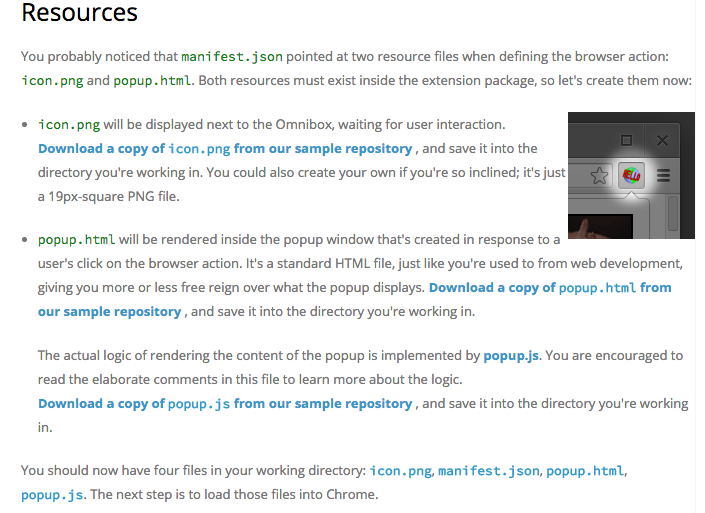
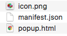
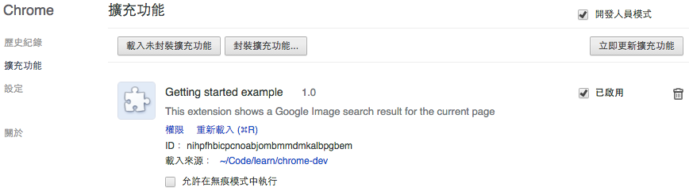

# Hello World

## 下載 Chrome 相關檔案

到「[Chrome 開發者網站](https://developer.chrome.com/extensions/getstarted)」下載 `icon.png`、`manifest.json`及`popup.html`檔案

> You should now have four files in your working directory: [icon.png](https://developer.chrome.com/extensions/examples/tutorials/getstarted/icon.png), [manifest.json](https://developer.chrome.com/extensions/examples/tutorials/getstarted/manifest.json), [popup.html](https://developer.chrome.com/extensions/examples/tutorials/getstarted/popup.html), popup.js. The next step is to load those files into Chrome.



## 將資源檔案放在同目錄下




## 編輯 `popup.html` 檔案

```html
<!doctype html>
<html>
  <head>
    <title>Getting Started Extension's Popup</title>
  </head>
  <body>
    Hello World
  </body>
</html>
```

## 設定 Chrome 開發者套件

開啟 Chrome 網址列輸入 `chrome://extensions/` 到擴充功能選單，點選 `開發人員模式`，點選 `載入未封裝擴充功能`，將資源檔案目錄加入此擴充套件中


## 已載入 Chrome 開發套件

載入套件後，會在下方看到已載入的套件




## 測試已載入 Chrome 開發套件

在上方套件列即可看到我們剛剛加入的開發套件 Hello World!!


## 相關資料
* [Getting Started: Building a Chrome Extension - Google Chrome](https://developer.chrome.com/extensions/getstarted)