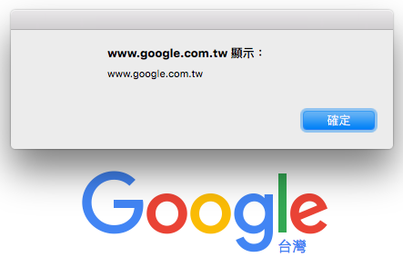

# Script 環境

## Content Script

可以讓你存取使用者頁面的 Script

> ***可以使用部分 Chrome 提供的 api 去擷取各種資訊 (e.g: `chrome.runtime.sendMessage()`)***

### 設定 Content Script

在 `manifest.json` 檔案中，我們可以設定符合指定的網址，執行我們的 CSS 跟 JS

```json
{
    "content_scripts": [
        {
            "matches": ["http://*/*", "https://*/*"],
            "css": ["app.css"],
            "js": ["app.js"]
        },
        {
            "matches": ["http://kejyun.com/", "https://kejyun.com/"],
            "css": ["kejyun.css"],
            "js": ["jquery.js","kejyun.js"]
        }
    ]
}
```

在設定的時候，若有需要使用像是 jQuery 套件，則必須在我們自己的 `kejyun.js` Script 之前就載入 `jqeury.js`，所以陣列的順序會影響載入的順序

### 編輯 `app.js`

在 `app.js` 檔案中我們加入一個簡單的 `alert()` 印出該網域

```javascript
// app.js
alert(document.domain);
```

編輯完後重新載入套件讓他可以讀取新的設定跟程式，我們到 [Google](https://www.google.com.tw) 網站去測試，就可以看到下列的 `alert` 訊息了




## Popup Script

### 設定 Popup Script

在我們的 `popup.html` 當中，我們可以載入這個頁面的 js

> ***沒辦法使用任何 Chrome 提供的 API 去進行操作***

```html
<!doctype html>
<html>
  <head>
    <title>Getting Started Extension's Popup</title>
    <script src="popup.js"></script>
  </head>
  <body>
    Hello World
  </body>
</html>
```

### 編輯 `popup.js`

在 `popup.js` 當中我們一樣載入一個簡單的 alert，去印出他的網域

```javascript
alert(document.domain);
```

編輯完後重新載入套件讓他可以讀取新的設定跟程式，我們點選套件的按鈕，就可以看到下列的 `alert` 訊息了


這裡你會發現印出來的 alert 訊息是 **nihpfhbicpcnoabjombmmdmkalbpgbem**，而不是我們所熟知的網域，其實這裡的網域指的是該套件的字定義網域，可以在擴充功能套件中看到這個 ID


所以 `popup.js` 僅能夠存取該頁面顯示的資料內容

像是我如果將 `popup.js` 程式改為修改文件頁面資料時，你會看到只有該 popup 的頁面資料會被修改到

```javascript
document.write('Hi Taiwan');
```


## Background Script

在套件背景執行的 Script，沒辦法直接存取使用者頁面上任何的 DOM

> 可以使用全部 Chrome 提供的 API 套件

### 設定 Background Script

在 `manifest.json` 檔案中，我們可以設定我們的 **Background Script** 在哪裡，這裡也跟 **Content Script** 一樣，JS 檔案的順序會影響載入的順序

```json
{
    "background": {
        "scripts": ["jquery.js", "background.js"]
    },
}
```

### 編輯 `background.js`

```javascript
alert(document.location);
```

編輯完後重新載入套件讓他可以讀取新的設定跟程式，就可以看到下列的 `alert` 訊息了，你會發現 Backgound Script 是在 `chrome-extension://nihpfhbicpcnoabjombmmdmkalbpgbem/_generated_background_page.html` 路徑當中


## 參考資料
* [Content Scripts - Google Chrome](https://developer.chrome.com/extensions/content_scripts)
* [Chrome Extension Tutorial 3: Script Environments - YouTube](https://www.youtube.com/watch?v=y3y4W3g12cU&list=PLYxzS__5yYQlWil-vQ-y7NR902ovyq1Xi&index=3)